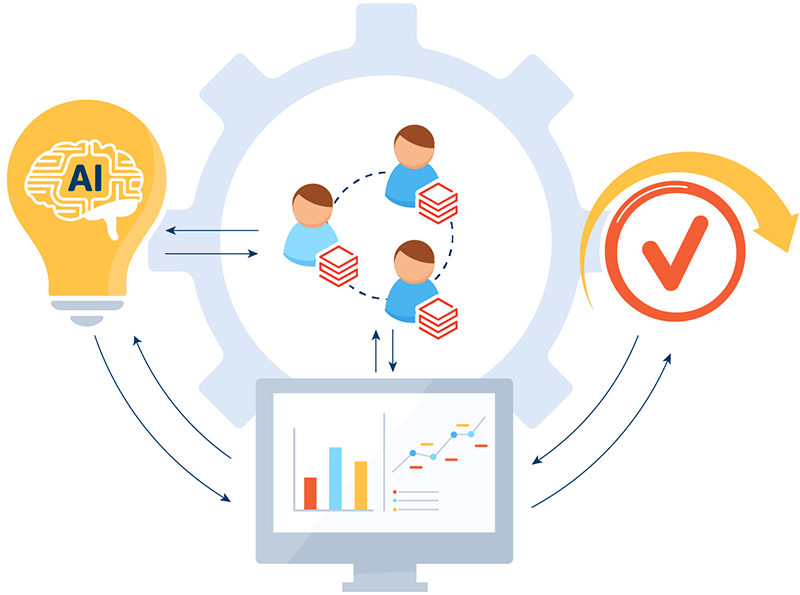

# Hystax OptScale integrates Databricks for improved ML/AI resource management

Hystax is excited to announce Databricks cost management within the OptScale MLOps platform.
 
 
Responding to customers’ feedback and committed to enhancing cloud usage efficiency, we have recognized the importance of including Databricks expense tracking and visibility in OptScale. This functionality provides a detailed and controlled approach to managing Databricks costs.

## Feature overview
Supporting Databricks in the Hystax OptScale platform is designed to improve visibility and control over Databricks expenses and give details on which experiments the costs are distributed (or how the Databricks costs are distributed across ML experiments and tasks). Here's a brief overview of the key functionalities:

- Unified experience: The connected Databricks data source is managed in the same way as other data sources.
- Cost allocation: OptScale captures metadata from Databricks resources, such as name, tags, and region, enabling effective cost allocation.
- Custom pricing support: If your organization has a custom agreement with Databricks and uses custom rates for Databricks services, these can be reflected in the connection properties. This alignment ensures the expenses shown in OptScale match your final bill.
## Future roadmap for Databricks integration
For Hystax, the current state of Databricks cost management integration is not the limit, and we plan to extend this functionality further to allow ML companies to achieve complete cost transparency and control over Databricks costs.

One of the upcoming features is linking Databricks expenses with the expenses of the underlying cloud infrastructure for a comprehensive view and better transparency. This approach will enable organizations to understand their cloud spending details fully.
